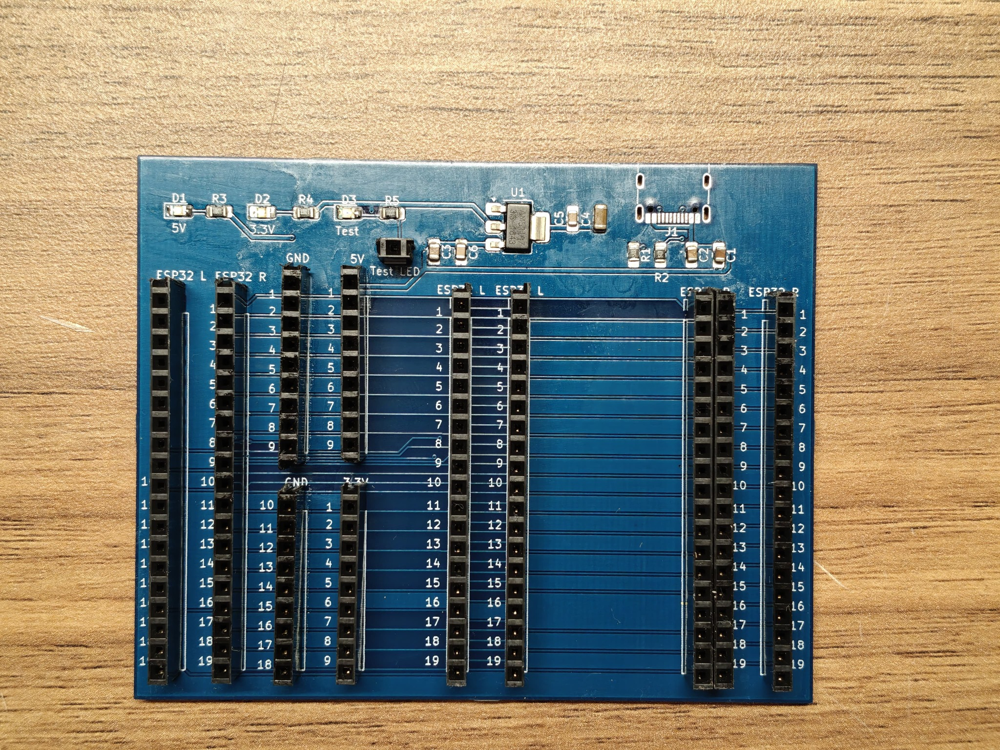
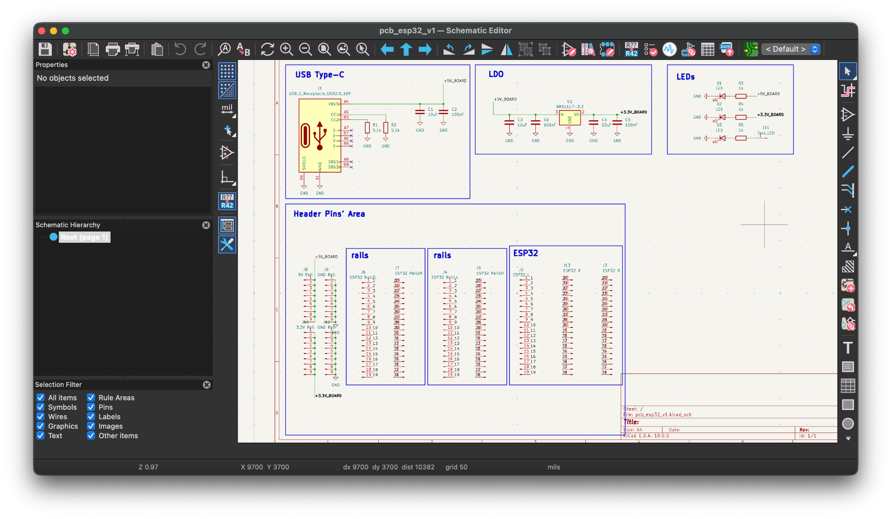
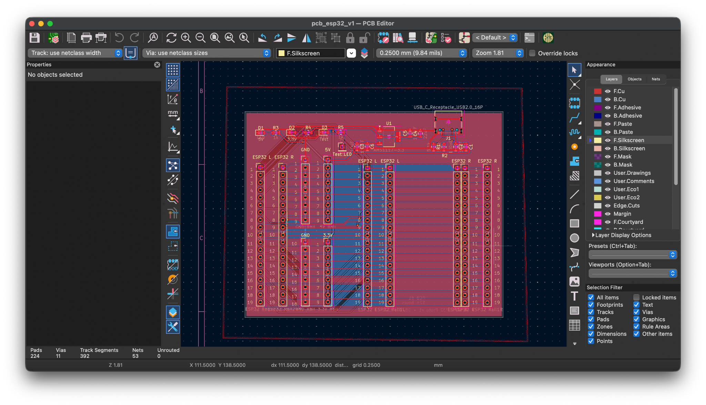
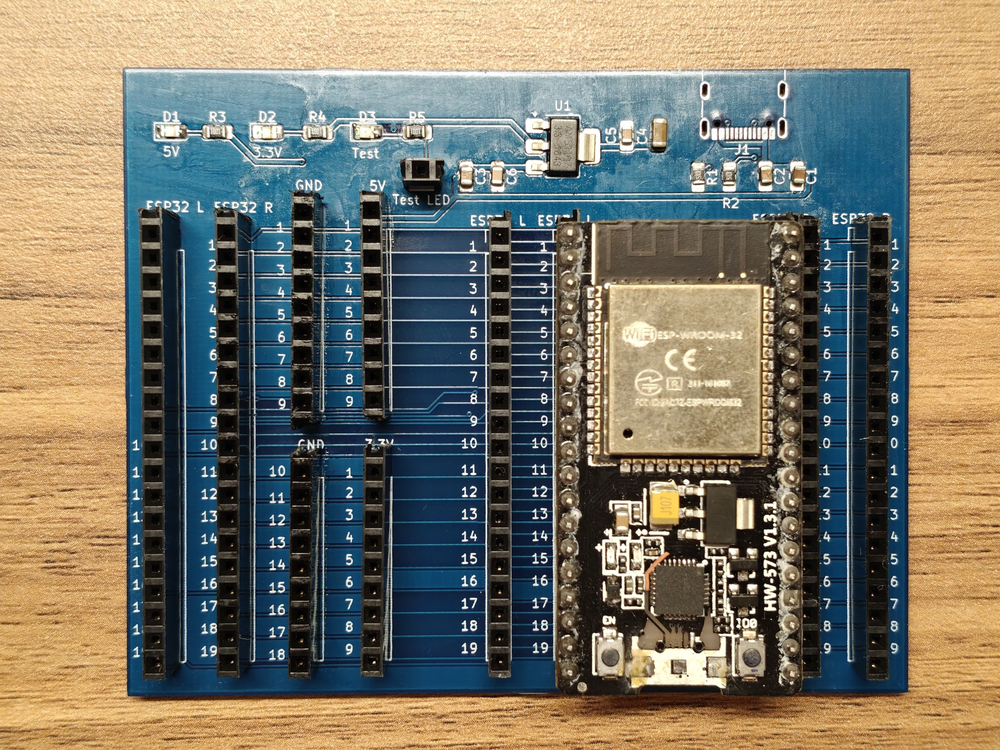
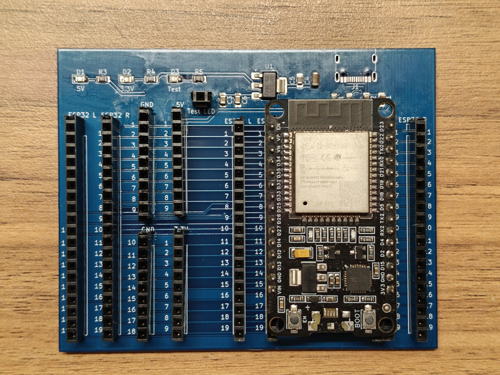
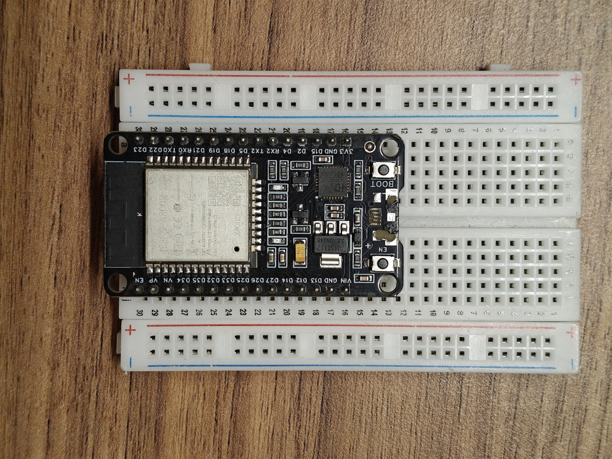
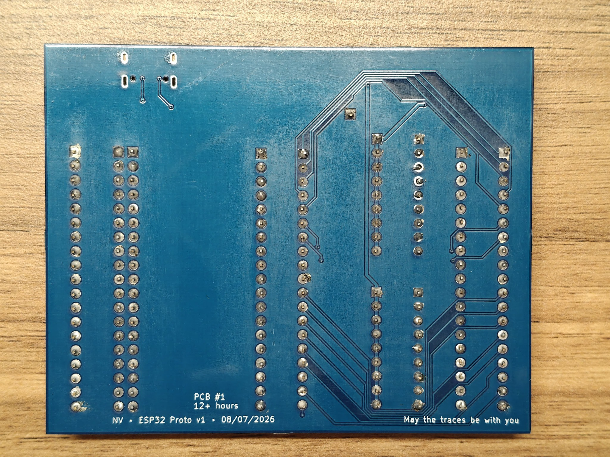

# ESP32 Prototyping & Breakout Board

A custom PCB designed to make ESP32 prototyping easier, faster, and more convenient than working directly on a breadboard or perfboard.



## Overview

When working with ESP32 development boards, the physical form factor can make breadboard prototyping inconvenient. In particular, larger ESP32 boards can occupy a large portion of a breadboard and restrict convenient access to the pins on both sides.

A perfboard can solve some of these problems, but manually wiring a large number of closely spaced GPIO connections is tedious and time-consuming.

This project was created as a reusable PCB-based prototyping platform. The ESP32 is mounted on the board while its pins are brought out to multiple accessible header rows. The board also provides dedicated power and ground connections and supports more than one ESP32 development-board form factor.

The goal is not to replace a breadboard for every project, but to make repeated ESP32 prototyping cleaner and faster.

## Motivation

The project started from a simple practical problem:

- A larger ESP32 development board does not leave convenient access to both sides of a breadboard.
- Connecting peripherals to both sides of the ESP32 can therefore become awkward.
- Dense adjacent GPIO connections on a perfboard require a lot of manual soldering.
- A custom PCB provides a repeatable layout that can be reused across multiple ESP32 prototypes.
- Since the board was already being designed for the larger ESP32 form factor, the layout was made compatible with a smaller ESP32 board as well.

### Breadboard vs. Custom PCB

The photographs in `Images/` show the motivation for the design.

The larger ESP32 board occupies a significant area of the breadboard, limiting convenient access to the surrounding rows. The custom PCB instead places the ESP32 in the center and distributes its connections across accessible header rows.

## Features

- ESP32 pin breakout through multiple 2.54 mm header rows
- Dedicated GND connections
- Dedicated 5 V connections
- Dedicated 3.3 V connections
- USB Type-C input circuit on the PCB
- USB Type-C CC resistors
- AMS1117-3.3 V linear regulator
- Regulator input/output capacitors
- 5 V indicator LED
- 3.3 V indicator LED
- Separate test LED
- Through-hole headers with SMD supporting circuitry
- Designed for multiple ESP32 development-board form factors
- Compact custom PCB: approximately **87.62 mm × 70 mm**
- Final PCB layout completed with no unrouted connections in KiCad

> **Note:** The USB Type-C connector itself has not yet been sourced by me, so it is **not soldered onto the current physical PCB**. The connector footprint and supporting circuitry are present in the PCB design, but the current prototype does not have the Type-C connector populated.

## Hardware Design

### Block Diagram

```text
                    USB Type-C
                        |
                        v
                    5 V Rail
                   /       \
                  /         \
             5 V LED      AMS1117-3.3
                              |
                              v
                         3.3 V Rail
                              |
                              v
                           ESP32
                              |
             +----------------+----------------+
             |                |                |
          GPIO Headers     GND Headers     Power Headers
```

### Schematic



The schematic is divided into:

- USB Type-C input
- 3.3 V regulation
- Indicator LEDs
- ESP32 header connections
- Power and ground rails

## PCB Design



The board was designed in **KiCad**.

The layout contains multiple parallel ESP32 header rows so that the ESP32 connections remain accessible while the ESP32 is mounted on the board.

The final PCB has:

- Board size: **87.62 mm × 70 mm**
- 2.54 mm header spacing
- SMD power/regulator circuitry
- Through-hole ESP32/header connections
- USB Type-C footprint and supporting circuit
- Dedicated power and ground access

## Physical Board

### PCB without ESP32


The board exposes the ESP32 connections through the surrounding header rows.

### PCB with larger ESP32



The larger ESP32 development board fits into the central position while leaving the breakout headers accessible.

### PCB with smaller ESP32



The board was also designed to accommodate a smaller ESP32 development-board form factor.

### ESP32 on a Breadboard



This comparison illustrates the original motivation for the project: using a larger ESP32 board directly on a breadboard can make access to both sides inconvenient.

### Back of the PCB



The back side shows the routing and the first-board markings:

> PCB #1 — 12+ hours  
> NV • ESP32 Proto v1 • 08/07/2026  
> May the traces be with you

## Pinout

The header arrangement uses the **ESP32 module pin numbers** used in the KiCad schematic.

The pinout documentation is available in:

[`Documentation/Pinout.md`](Documentation/Pinout.md)

The four 19-pin breakout rows are arranged as paired groups:

- One row exposes ESP32 module pins **1–19**
- The paired row exposes ESP32 module pins **20–38**

This arrangement is repeated for the supported ESP32 board positions.

> The schematic uses the module's physical pin numbers (1–38). It does not label these connections with GPIO names, so the pinout document intentionally preserves the numbering used by the design rather than introducing a separate GPIO mapping.

## Design Files

The `KiCad/` directory contains the editable KiCad project:

```text
KiCad/
├── pcb_esp32_v1.kicad_pro
├── pcb_esp32_v1.kicad_sch
└── pcb_esp32_v1.kicad_pcb
```

### Fabrication Files

The `Fabrication/` directory is intended for files required to reproduce the physical board:

```text
Fabrication/
├── final_gerbers.zip
└── bom.csv
```

### Gerbers

Gerber files describe the PCB layers and board geometry used by a PCB manufacturer to fabricate the bare PCB.

### Bill of Materials (BOM)

The BOM lists the components required to assemble the board, including their references, values, footprints, and quantities.

A CSV BOM can be placed in:

```text
Fabrication/bom.csv
```

## Repository Structure

```text
ESP32-Prototyping-Breakout/
│
├── README.md
├── LICENSE
├── .gitignore
│
├── KiCad/
│   ├── pcb_esp32_v1.kicad_pro
│   ├── pcb_esp32_v1.kicad_sch
│   └── pcb_esp32_v1.kicad_pcb
│
├── Fabrication/
│   ├── final_gerbers.zip
│   └── bom.csv
│
├── Documentation/
│   └── Pinout.md
│
└── Images/
    ├── 01_esp32_on_breadboard.jpg
    ├── 02_pcb_with_esp32_form_factor_1.jpg
    ├── 03_pcb_with_esp32_form_factor_2.jpg
    ├── 04_large_esp32_on_breadboard.jpg
    ├── 05_pcb_front.jpg
    ├── 06_pcb_back.jpg
    ├── 07_pcb_layout.png
    └── 08_schematic.png
```

## Project Status

**Version:** v1

This is a personal prototype and my first custom PCB design.

The physical board was fabricated and assembled for ESP32 prototyping and experimentation.

The current physical prototype has the USB Type-C connector footprint unpopulated because the connector has not yet been sourced.

The board was designed as a practical development aid rather than as a production-ready commercial board.

## Future Improvements

Possible improvements for a future revision include:

- Populate and validate the USB Type-C connector
- More clearly standardized pin labels
- Additional protection circuitry
- Improved mechanical mounting options
- Additional prototyping headers
- Further optimization of board size and routing
- Additional ESP32 development-board compatibility

## Tools

- **KiCad** — schematic capture and PCB design
- **PCB fabrication** — custom manufactured PCB
- **ESP32 development boards** — hardware validation and prototyping

## License

This hardware design and associated documentation are released under the MIT License. See [`LICENSE`](LICENSE) for details.

## Author

**Nisarg Vyas**

Computer Science & Engineering

---

> *PCB #1 — 12+ hours*  
> *May the traces be with you.*
